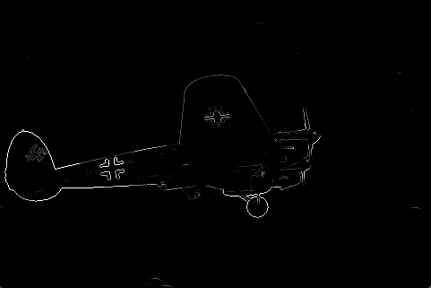

# Shake My Boundary
We implement a simple pb-lite edge detection algorithm in this project. First, generate four filter banks which are oriented Derivative of Gaussian (DoG), Leung-Malik (LM), Gabor, and Half-disc. By using these filters, we can create a texture map of the image. Also, use KMeans clustering to generate brightness and color. Then, implement chi-square distance combined with sobel and canny edges and will have pb-lite edges of the image. You can find the details of the project on this [website](https://cmsc733.github.io/2022/hw/hw0/).

## Overview
The overview of the pb-lite edge detection algorithm is shown below.


## Dependencies
- opencv-python
- numpy
- tqdm
- scikit-learn
- scikit-image
- matplotlib


## Structure
- `BSDS500`: Images of canny and Sobel baselines. Also with original images.
- `Code`: All codes for generating pb-lite edge detection
- `Figures`: Some results of pb-lite edge detection algorithm

## Usage
Use the following command to generate the results of the pb-lite edge detection
```
python3 ./Wrapper.py
```
## Visualization
The figures below show the color, brightness, texture maps, and their gradient maps. Also shows the comparison between canny, sobel, and pb-lite edge detection algorithms.


Brightness Gradient |  Color Gradient | Texture Gradient
:-------------------------:|:-------------------------:|:-------------------------:
  |   | 

Brightness Map |  Color Map | Texton Map
:-------------------------:|:-------------------------:|:-------------------------:
  |   | 


Canny Baseline |  Sobel Baseline | Pb-Lite
:-------------------------:|:-------------------------:|:-------------------------:
  |   | 

## References
Arbelaez, Pablo, et al. "Contour detection and hierarchical image segmentation." IEEE transactions on pattern analysis and machine intelligence 33.5 (2010): 898-916.
